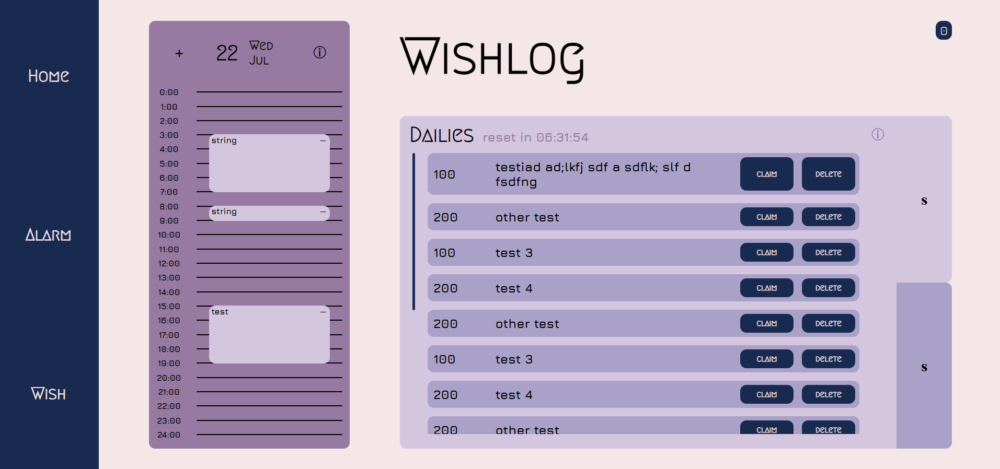
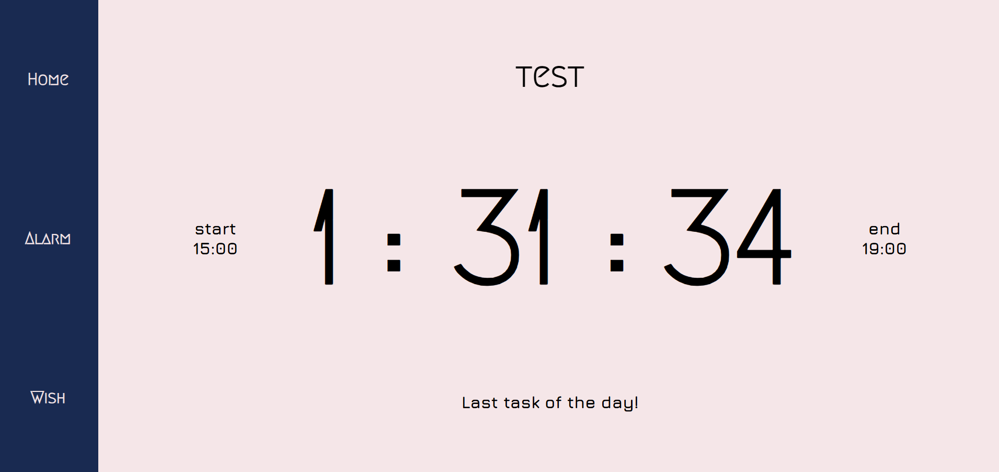

# Wishlog

Wishlog is a planner site that allows users to schedule their day and set tasks. Drawing inspiration from gacha games, Wishlog rewards consistent behavior with currency to fulfill your collecting dreams.

Wishlog is made with React.

Demo on Vercel: https://wishlog-gules.vercel.app/ :D

No AI was used.